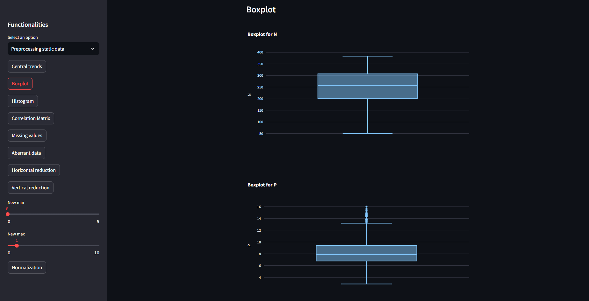
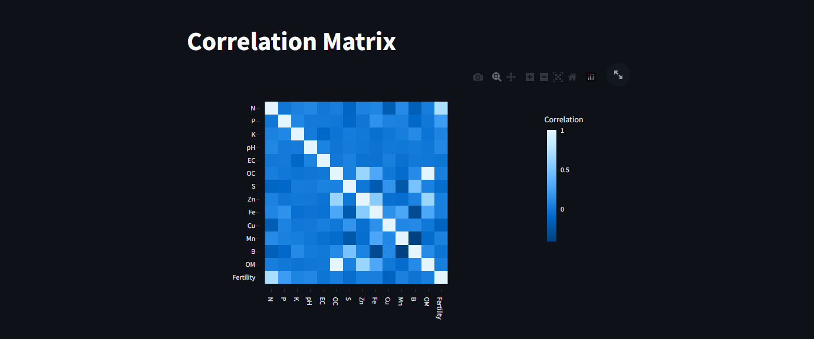
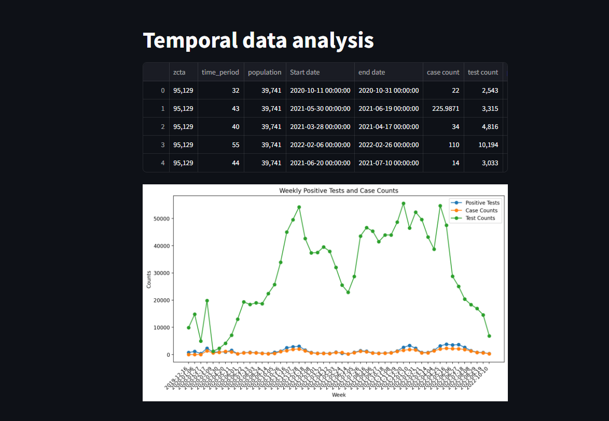
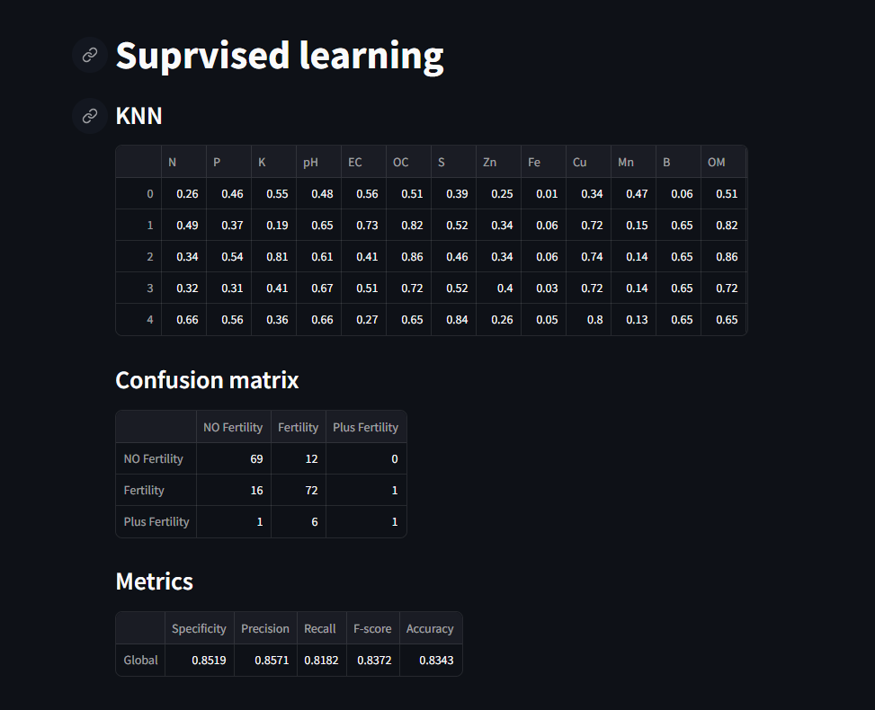
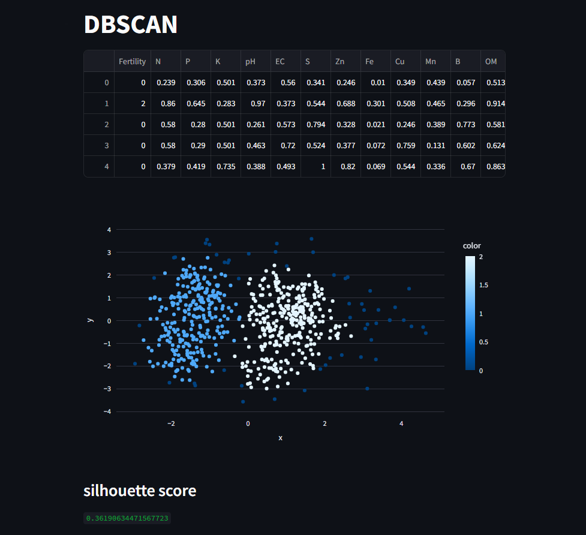

# Data mining and machine learning Project

## Table of contents

- [Overview](#overview)
- [Dashboard](#dashboard)
- [Data preprocessing and association rules](#data-preprocessing-and-association-rules)
- [Supervised learning](#supervised-learning)
- [Unsupervised learning](#unsupervised-learning)
- [How to install](#how-to-install)

## Overview

This project treat 3 different datasets. The first one is about ground properties for fertility analysis, the second one is about COVID-19 cases evolution, and the third one is about the relationship between the climate attributes with the ground and the vegetation. The main goal of this project is to analyze the data and extract useful information from it. The project is divided into 4 main parts: data preprocessing and association rules, supervised learning, unsupervised learning, and a dashboard to summerize the results.

## Dashboard

The dashboard is a web application that allows the user to visualize the results of the analysis. The user can choose the dataset and the analysis to visualize. The dashboard is implemented using Dash, a Python framework for building analytical web applications.

### screenshots

## Data preprocessing and association rules

The first part of the project is about data preprocessing and association rules. The goal of this part is to clean the data and extract useful information from it. The data preprocessing is done using Pandas, a Python library for data manipulation and analysis. The association rules are extracted using the Apriori algorithm, a popular algorithm for mining frequent itemsets and generating association rules.

## Supervised learning

The second part of the project is about supervised learning. The goal of this part is to build a model that can predict the value of a target variable based on the values of other variables. The supervised learning algorithms used in this part are K-Nearest Neighbors, Decision Trees, Random Forest, The performance of the models is evaluated using the accuracy, precision, recall, and F1-score metrics.

## Unsupervised learning

The third part of the project is about unsupervised learning. The goal of this part is to cluster the data into groups based on the values of the variables. The unsupervised learning algorithms used in this part are K-Means, DBSCAN,
The performance of the models is evaluated using the silhouette score.

## How to install

1. Install the required dependencies: `pip install -r requirements.txt`
2. run the command ` streamlit run interface.py`

The app will run on `http://localhost:8501/`
