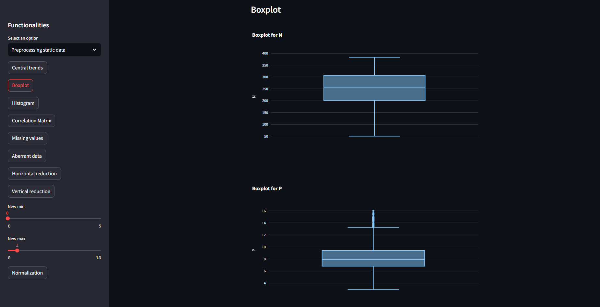
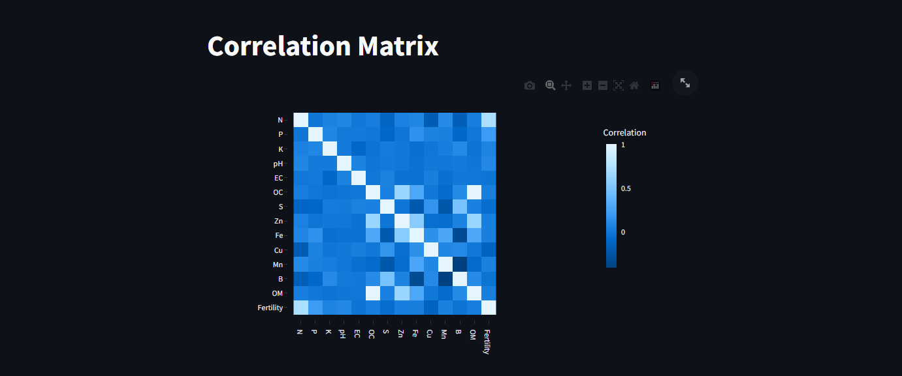
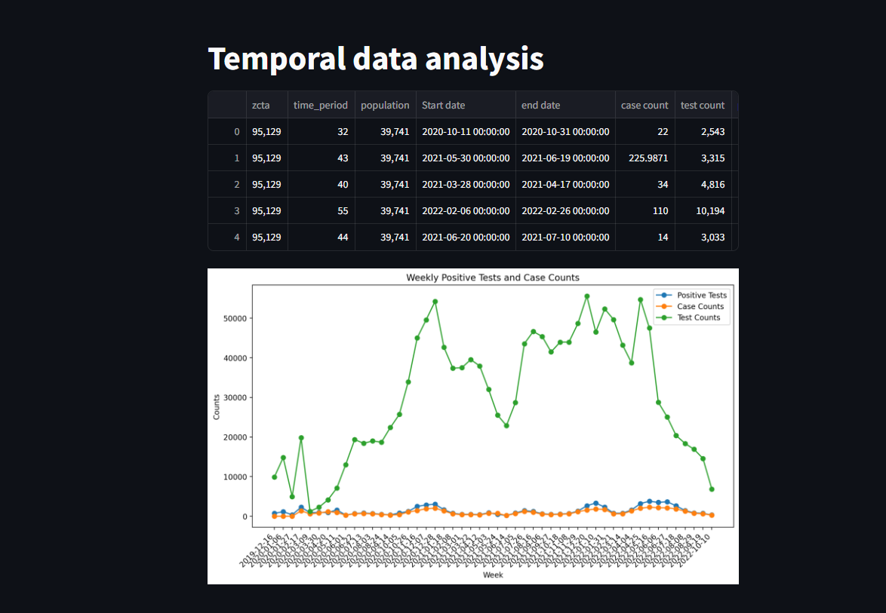
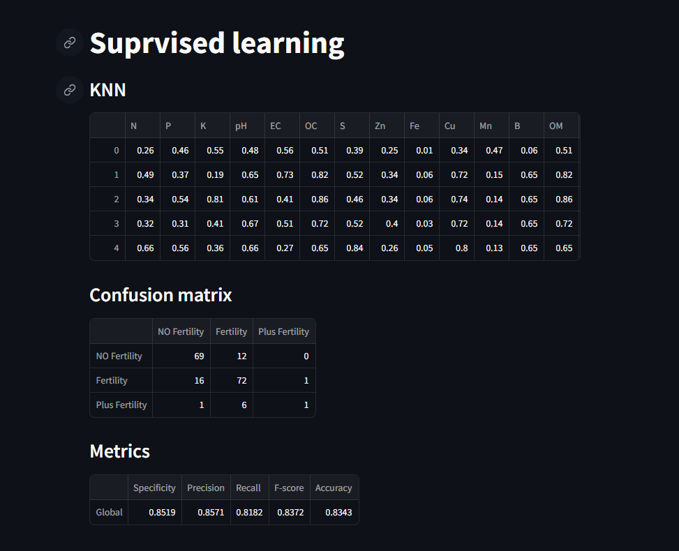
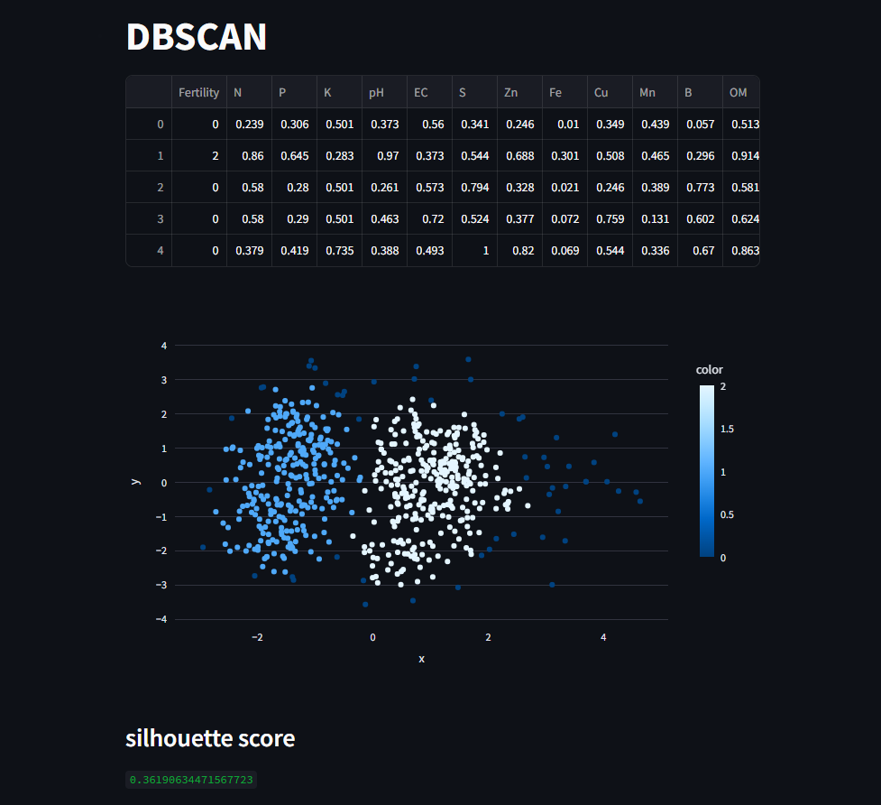

# Data Mining & Machine Learning Project

An end-to-end data mining toolkit and interactive dashboard. It covers data
preprocessing, association rule mining, supervised and unsupervised learning,
and temporal analysis on three real-world datasets. The core algorithms (Apriori,
KNN, decision trees, random forests, K-Means, DBSCAN) are implemented from scratch
in plain Python/NumPy/pandas.

## Table of contents

- [Datasets](#datasets)
- [Features](#features)
- [Project structure](#project-structure)
- [Getting started](#getting-started)
- [Usage](#usage)
- [Dashboard](#dashboard)

## Datasets

| Dataset | File | Description |
| --- | --- | --- |
| Soil fertility | `data/raw/Dataset1.csv` | Soil properties (N, P, K, pH, EC, ...) with a fertility class (0, 1, 2) |
| COVID-19 | `data/raw/Dataset2.csv` | Case, test and positivity counts per ZIP code area over time |
| Climate & crops | `data/raw/Dataset3.csv` | Temperature, humidity and rainfall with soil, crop and fertilizer |

Cleaned and transformed versions used by the dashboard live in `data/processed/`.

## Features

- **Preprocessing** (`datamining/preprocessing.py`): central tendency measures,
  box plots and outlier detection, correlation analysis, missing-value imputation
  (decision tree), outlier replacement (linear regression), horizontal and vertical
  data reduction, min-max and z-score normalization.
- **Temporal analysis** (`datamining/temporal.py`): date repair, imputation and
  outlier treatment for the COVID-19 data, plus weekly/monthly/yearly aggregations
  and plots.
- **Association rules** (`datamining/association_rules.py`): equal-frequency and
  equal-width discretization, Apriori, and rule filtering by confidence, lift or
  cosine.
- **Supervised learning** (`datamining/supervised.py`): KNN (Euclidean, Manhattan,
  cosine, Minkowski), decision trees and random forests for discrete and continuous
  attributes, confusion matrix with accuracy, precision, recall, specificity and F-score.
- **Unsupervised learning** (`datamining/unsupervised.py`): K-Means and DBSCAN with
  selectable distance functions, PCA projection, silhouette score.

## Project structure

```
.
├── app.py                      # Streamlit dashboard
├── datamining/                 # Library code
│   ├── config.py               # Data paths
│   ├── datasets.py             # Dataset loading and cleaning
│   ├── preprocessing.py
│   ├── temporal.py
│   ├── association_rules.py
│   ├── supervised.py
│   └── unsupervised.py
├── scripts/                    # Command-line entry points
│   ├── build_datasets.py       # Regenerate cleaned COVID-19 / climate CSVs
│   ├── preprocess_fertility.py # Full preprocessing pipeline on Dataset 1
│   ├── mine_association_rules.py
│   └── tune_dbscan.py          # Grid search for DBSCAN parameters
├── data/
│   ├── raw/                    # Original datasets
│   └── processed/              # Cleaned / transformed datasets
├── assets/                     # Dashboard screenshots
└── requirements.txt
```

## Getting started

Requires Python 3.9+.

```bash
python -m venv .venv
source .venv/bin/activate        # Windows: .venv\Scripts\activate
pip install -r requirements.txt
```

## Usage

### Dashboard

```bash
streamlit run app.py
```

The app is served at <http://localhost:8501>. Pick an analysis in the sidebar,
adjust its parameters and click the corresponding button.

### Scripts

Run from the repository root:

```bash
# Rebuild data/processed/Dataset2_clean.csv and Dataset3-filtered.csv
python scripts/build_datasets.py

# Preprocessing pipeline on the fertility dataset
python scripts/preprocess_fertility.py

# Mine association rules (method: confidence | lift | cosine)
python scripts/mine_association_rules.py --support 0.3 --confidence 0.5 --method lift

# Find the best DBSCAN eps / min_samples
python scripts/tune_dbscan.py
```

### As a library

```python
from datamining.datasets import load_fertility
from datamining.supervised import split_data, DecisionTreeC, confusion_matrix1

train_X, train_Y, test_X, test_Y = split_data(load_fertility(), 0.8)
tree = DecisionTreeC(min_split=2, max_depth=10, alg="gini")
tree.fit(train_X, train_Y)
pred = tree.predict_all(test_X, test_Y)
matrix, metrics = confusion_matrix1(pred["Fertility"], pred["Predicted"])
```

## Dashboard






